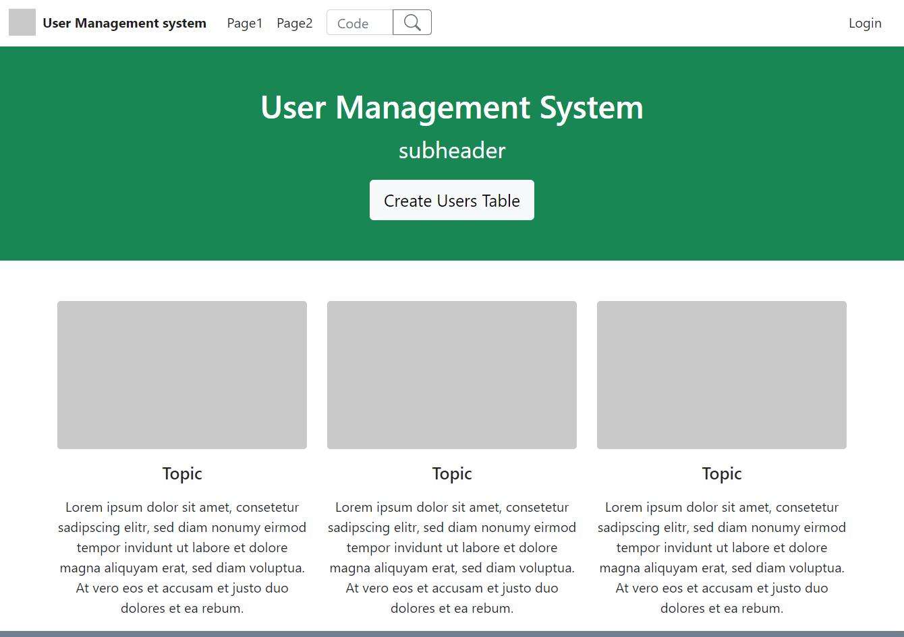
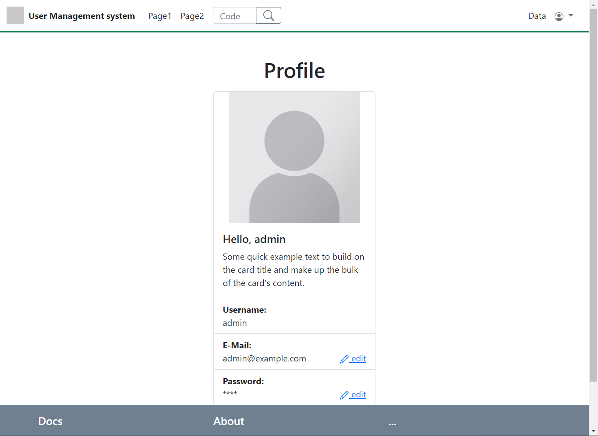
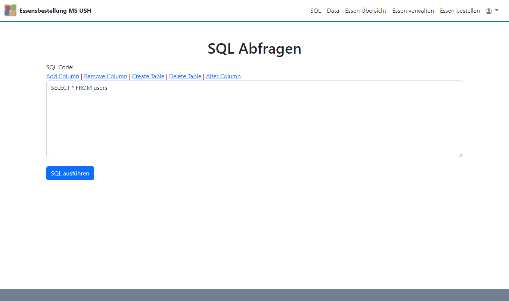

# modular user management system

The simple modular user management system gives you a starting point to develop user management systems with database connection. 

You can find templates in /www/templates/. The following templates are currently available:
- login 
- profile 
- sql editor
- data 
- essen verwalten
- essen bestellen

## Docker setup
- download Docker
- run Docker desktop app
- run `docker-compose up` to start the nginx server
- open [http://127.0.0.1](http://127.0.0.1) to go to the user management website
- you can connect to the maria db database with dbeaver:
  - Server-Host: `localhost`
  - Port: `3306`
  - DatabaseName: `tutorial`
  - Username: `tutorial`
  - Password: `secret`  
- SQL tables are created live with buttons on the startpage 

### Start Page

### Profile Page

### Data Page

## Infos
- [https://www.sitepoint.com/docker-php-development-environment/](https://www.sitepoint.com/docker-php-development-environment/)
- used libraries:
  - jQuery
  - bootstrap
  - summernote

