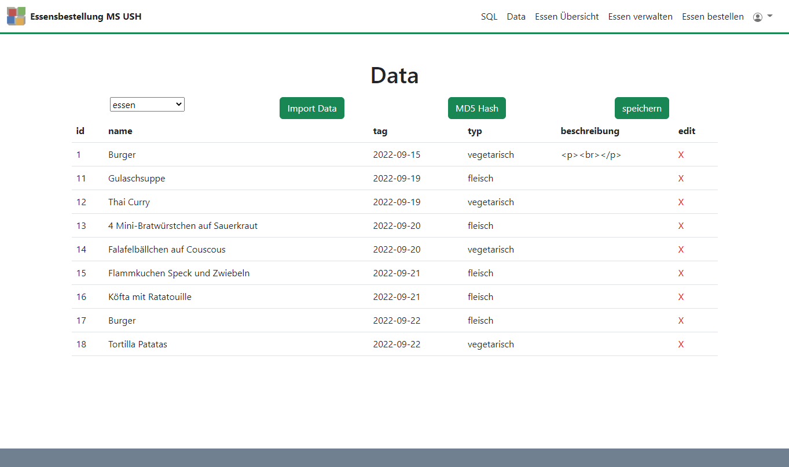

# modular user management system

The simple modular user management system gives you a starting point to develop user management systems with database connection.

You can find templates in /www/templates/. The following templates are currently available:

- login
- profile
- sql editor
- data
- essen verwalten
- essen bestellen
- essen übersicht

## Docker setup

- download Docker
- run Docker desktop app
- run `docker-compose up` to start the nginx server
- open [http://127.0.0.1](http://127.0.0.1) to go to the user management website
- you can connect to the maria db database with dbeaver:
  - Server-Host: `localhost`
  - Port: `3306`
  - DatabaseName: `tutorial`
  - Username: `tutorial`
  - Password: `secret`

## create DB users table

```sql

 CREATE TABLE users (
    id int(11) NOT NULL AUTO_INCREMENT PRIMARY KEY,
    username varchar(100) DEFAULT NULL,
    password varchar(100) DEFAULT NULL,
    email varchar(100) DEFAULT NULL,
    klasse varchar(10) DEFAULT NULL, -- for Template Essensbestellung
    role varchar(15) DEFAULT NULL
  )

```

### Start Page


### Profile Page


### SQL Page


### Data Page



## Infos

- [https://www.sitepoint.com/docker-php-development-environment/](https://www.sitepoint.com/docker-php-development-environment/)
- used libraries:
  - <a href="https://de.freepik.com/vektoren-kostenlos/niedliches-besteck-und-teller-set-design-element_14547819.htm#query=essen&position=37&from_view=search">Bild von rawpixel.com</a> auf Freepik
  - jQuery
  - bootstrap
  - summernote
