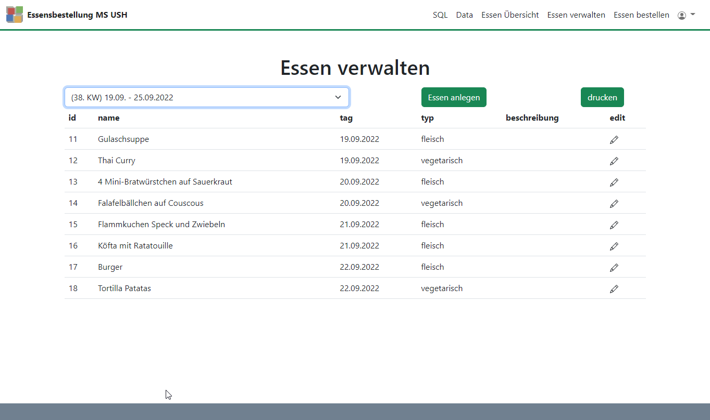
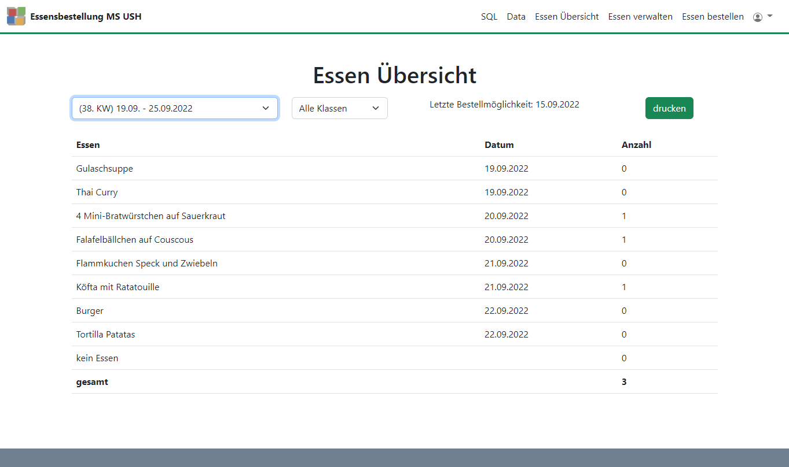
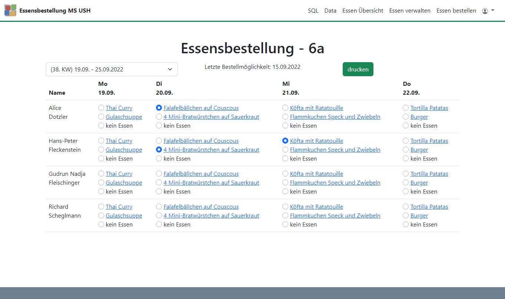

# Template Essensbestellung
Das Template Essensbestellung kann in der Schule für Mensabestellungen genutzt werden. Die Mensa gibt Essen für jeden Tag ein und die Klassenlehrer können für die Schüler Essen für jede Woche bestellen.

Nach der Bestellung werden die Bestellungen auf einer Übersicht für die Mensa angezeigt.
## Seiten des Templates:
- essen_verwalten.php (Essen kann von Mensamitarbeiter angelegt werden.)
- essen_bestellen.php (Essen kann von eingeloggten Lehrer-Usern für die Klasse bestellt werden.)
- essen-uebersicht.php (Übersicht über bestelltes Essen.)

## Datenbank

Das Template benötigt folgende Tabellen in der Datenbank:
- bei der bereits vorhandenen `user` Tabelle müssen die folgenden Felder hinzugefügt werden:
  - klasse z.B.: 5a,6a,...
  - role z.B.: admin, mensa, lehrer, ...
- schueler_essen
- schueler
- essen  

Bei der Essensbestellung für eine Klasse wird aus der allgemeinen `user`-Tabelle das Feld `klasse` genutzt, um die Schüler der dort gesetzten Klasse anzuzeigen.

Bei der Essensübersicht hat ein eingeloggter `user` mit der `role = admin` die Möglichkeit, für alle Klassen Essen zu bestellen.

```sql  
  CREATE TABLE schueler_essen (
    id int(11) NOT NULL AUTO_INCREMENT PRIMARY KEY,
    schueler_id int(11),
    essen_id int(11),
    tag varchar(15),
    UNIQUE KEY schueler_essen_UN (schueler_id, tag)
  );

  CREATE TABLE schueler (
    id int(11) NOT NULL AUTO_INCREMENT PRIMARY KEY,
    firstname varchar(100) DEFAULT NULL,
    lastname varchar(100) DEFAULT NULL,
    klasse varchar(10) DEFAULT NULL
  );

  CREATE TABLE essen (
    id INT(6) AUTO_INCREMENT PRIMARY KEY,
    name VARCHAR(150),
    tag VARCHAR(15),
    typ VARCHAR(15),
    beschreibung LONGTEXT
  );
```

### Testdaten für die Datenbank
Für Tabelle: users (Passwort ist gleich Accountname bzw. lehrer)
```
admin, $2y$10$eS3SdECgnIYkl1x8PkTmIO2Mlu4KcqvwxCTuM79JJAIu41OvgpJIO, admin@example.com, , admin
mensa, $2y$10$3OQnW79602Y1mfUxrrxtyuE4.S7/oz2ushlpebodZsO6TcotTLjPu, mensa@example.com, , mensa
lehrer5a, $2y$10$oQTqVSGUtwIAukyNGsW/yOlgLIQRebShbfiByik.Of64x5B9AJEkO, lehrer@example.com, 5a, lehrer
lehrer6a, $2y$10$oQTqVSGUtwIAukyNGsW/yOlgLIQRebShbfiByik.Of64x5B9AJEkO, lehrer@example.com, 6a, lehrer
```
Für Tabelle: essen
```
Gulaschsuppe, 2022-09-19, fleisch, 
Thai Curry, 2022-09-19, vegetarisch, 
4 Mini-Bratwürstchen auf Sauerkraut, 2022-09-20, fleisch, 
Falafelbällchen auf Couscous, 2022-09-20, vegetarisch, 
Flammkuchen Speck und Zwiebeln, 2022-09-21, fleisch, 
Köfta mit Ratatouille, 2022-09-21, fleisch, 
Burger, 2022-09-22, fleisch, 
Tortilla Patatas, 2022-09-22, vegetarisch, 
```
Für Tabelle: schueler
```
Thorsten,Böhm,5a
Chantalle,DeJaques,5a
Karsten,Dörfler,5a
Alice,Dotzler,6a
Hans-Peter,Fleckenstein,6a
Gudrun Nadja,Fleischinger,6a
```

## Pages
### Essen verwalten


### Essen Übersicht


### Essen bestellen
